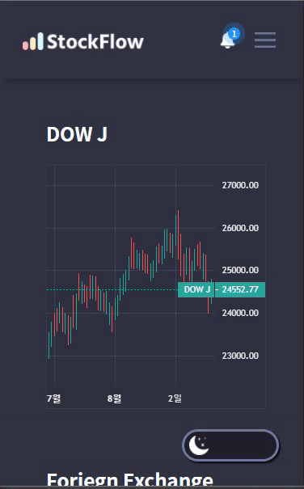

# 📈Stock Flow

주식 / 디지털화폐 정보의 데이터시각화

---

### [ PC Layout]

[](https://youtu.be/LnK441eviAA)

### [ Tablet Layout]


### [ Mobile Layout]



---

## **개발 인원 및 기간**

- 개발기간 : 2020/8/18 ~ 2020/9/23

## **기획의도**

보조지표(그래프)를 활용하여
시간 / 일 / 주간 / 월간 기준의 주식데이터를
사용자가 다양하게 볼 수 있도록 구현

## **개발 인원 및 기간**

- 개발기간 : 2020/8/18 ~ 2020/09/23
- 개발인원 : Front-End 4명(유진혁, 배준선, 도지현, 박민지)

---

## 적용기술

- HTML5

- SCSS

- javaScript

- react

- <details open>
  <summary>라이브러리</summary>
  1. react-router-dom<br>
  2. react-redux<br>
  3. redux-saga<br>
  4. axios<br>
  5. antd<br>
  6. antd-icon<br>
  7. eslint-plugin-react-hooks@next<br>
  8. node-sass<br>
  9. error-boundary<br>
  10. devtools-extension<br>
  11. connected-react-router<br>
  12. http-proxy-middleware<br>
  13. react-scripts<br>
  </details>

---

## **Getting Started**

API호출을 위한 key 파일은 업로드 되지 않았습니다.
**실행하기 위해서는 해당 파일을 요청하셔야 합니다.**
요청 email: dksro324@gmail.com

`npm i` to download package. you need key.js file on src folder. If you want to test this app, please send a mail to dksro324@gmail.com. Then I'll give you a key.js file

경로 : ./src/key.js

```
$ git clone "https://github.com/Stock-Flow/stockflow.git"
$ npm install
\$ npm start

```

## **How to run this app**

`npm i` to download package. you need key.js file on src folder. If you want to test this app, please send a mail to dksro324@gmail.com. Then I'll give you a key.js file

## **License**

**MIT License**

